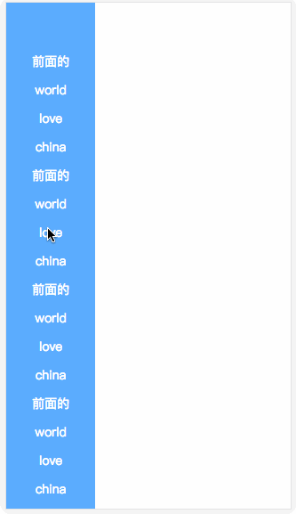
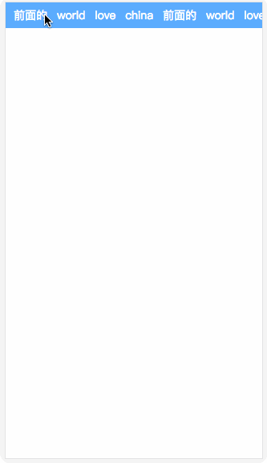

# vue-elastic-tab

> A Vue.js 2.0 Tab for Web.

> 一个惯性回弹导航tab




## Browser Support

Mobile terminal

## Install

```bash
npm i vue-elastic-tab
```

## Quick Start
```vue
// main.js
import vueElasticTab from 'vue-elastic-tab'
Vue.use(vueElasticTab)

// .vue
<template>
  <div id="app">		
    <vue-g-huitan
      GDirection="x" 
      :GNavName="li_array" 
      :GNavLink="li_array_link"
      GNavId="tanxinNav"
      GBg="#5cadff" 
      :GMaxWithY="100"></vue-g-huitan>
  </div>
</template>

<script>
export default {
  data () {
    return {
      li_array: ["前面的","world","love","china"],
      li_array_link: ["/hello","/world","/love","china"]
    }
  }
}
</script>

```

## API

| 参数       | 介绍                                            | 类型           | 默认值  | 示例                      |
| ---------- | ----------------------------------------------- | -------------- | ------- | ------------------------- |
| GDirection | tab方向                                         | String         | y       | GDirection="x"            |
| GNavName   | tab名                                           | Array（必须）  | -       | :GNavName="li_array"      |
| GNavLink   | tab链接                                         | Array          | -       | :GNavLink="li_array_link" |
| GNavId     | tab的ID                                         | String（必须） | g_navid | GNavId="tanxinNav"        |
| GBg        | tab背景颜色                                     | String         | #ececec | GBg="#5cadff"             |
| GMaxWithY  | tab最大宽度，GDirection="y"时起作用。（单位px） | Number         | -       | :GMaxWithY="100"          |
|            |                                                 |                |         |                           |

## license

MIT
